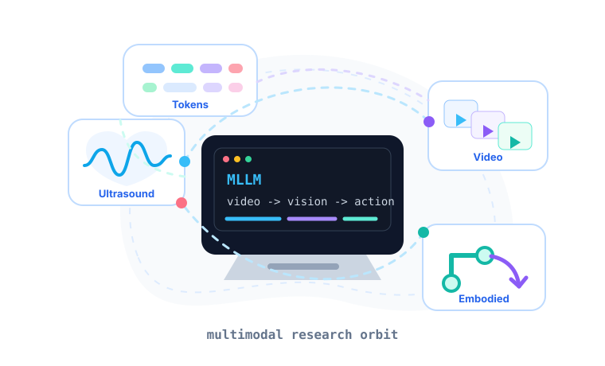

 

<table>
  <tr>
    <td width="52%" valign="top">

## Hi there

- Hi, I'm **Ye Yang**.
- Exploring AI for **ultrasound medicine** and **medical imaging**.
- Focused on **video analysis**, **temporal understanding**, and **MLLMs**.
- Interested in **embodied intelligence** and perception-action systems.
- I build, break, and measure multimodal AI systems until they become useful.
- Keeping notes on papers, experiments, datasets, and model behavior.
- Always learning, always building.
- QQ Mail: [1194571448@qq.com](mailto:1194571448@qq.com)
- Google Mail: [yangye659@gmail.com](mailto:yangye659@gmail.com)

    </td>
    <td width="48%" valign="top">

    </td>
  </tr>
</table>

 

<picture>
  <source media="(prefers-color-scheme: dark)" srcset="https://raw.githubusercontent.com/ye-yang-ai/ye-yang-ai/output/github-contribution-grid-snake-dark.svg" />
  <source media="(prefers-color-scheme: light)" srcset="https://raw.githubusercontent.com/ye-yang-ai/ye-yang-ai/output/github-contribution-grid-snake.svg" />
  
</picture>

---

**Medical AI** | **Multimodal Learning** | **Video Understanding** | **Embodied Intelligence**

